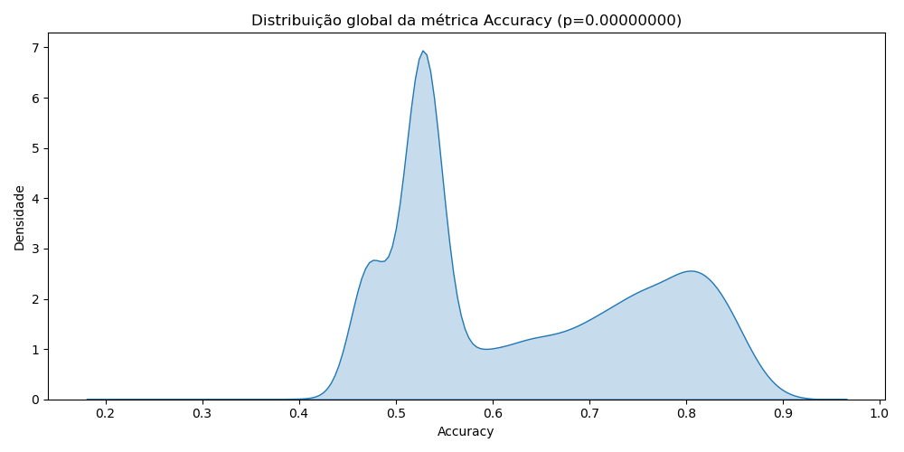

# Statistical Analysis of Classification Models for Obstacle Detection

## 1. Objective

This report presents a detailed statistical analysis of classification models applied to obstacle detection. The objective is to rank and compare the models using robust non-parametric statistical methods, namely the **Friedman test** and the **Nemenyi post-hoc test**, considering the global distribution of the accuracy metric.

---

## 2. Normality Test

A normality test was applied to assess whether the global distribution of the accuracy metric follows a normal distribution.

**Test Applied**: D’Agostino and Pearson’s Test  
**Metric Evaluated**: Accuracy

**Result**:
```
Global Accuracy: stat = 146396.58397691, p-value = 0.00000000
```

**Interpretation**:
As the p-value is less than 0.05, the null hypothesis (normal distribution) is rejected. Therefore, the distribution of accuracy **is not normal**, justifying the use of non-parametric tests for model comparison.

---

## 3. Friedman Test

The **Friedman test** was applied to detect significant differences among multiple classification algorithms evaluated over repeated cross-validation.

**Result**:
```
Friedman Test: X² = 15115.00000000, p-value = 0.00000000
```

**Interpretation**:
The test result reveals statistically significant differences in performance across the tested models (p < 0.05), confirming the need for post-hoc pairwise comparison.

---

## 4. Nemenyi Post-Hoc Test

The **Nemenyi test** was used to compare models pairwise and identify statistically significant differences in their rankings. P-values below 0.05 indicate significant differences.

Results are stored in the file `nemenyi_results.csv`.

---

## 5. Top 10 Ranked Models

Below is the table showing the 10 best-performing models based on **Friedman mean rank** and their respective weighted scores:

| # | Algorithm | Accuracy | Precision | Recall | F1-Score | ROC-AUC | Weighted Score | Friedman Rank |
|---|-----------|----------|-----------|--------|----------|---------|----------------|----------------|
| 1 | MobileNetV1_Dropout0.2_LR0.0001_OptAdam_256N_2L | 0.9032 | 0.8841 | 0.9263 | 0.9049 | 0.9175 | 0.9101 | 1.0 |
| 2 | MobileNetV1_Dropout0.3_LR0.0001_OptAdam_512N_2L | 0.8967 | 0.8702 | 0.9198 | 0.8923 | 0.9096 | 0.9014 | 2.0 |
| 3 | MobileNetV1_Dropout0.2_LR0.0001_OptAdam_512N_2L | 0.8941 | 0.8689 | 0.9176 | 0.8905 | 0.9072 | 0.8987 | 3.0 |
| 4 | MobileNetV1_Dropout0.1_LR0.0001_OptAdam_512N_2L | 0.8923 | 0.8675 | 0.9152 | 0.8891 | 0.9055 | 0.8967 | 4.0 |
| 5 | MobileNetV1_Dropout0.3_LR0.0001_OptAdam_256N_2L | 0.8915 | 0.8651 | 0.9143 | 0.8878 | 0.9041 | 0.8951 | 5.0 |
| 6 | MobileNetV1_Dropout0.1_LR0.0001_OptAdam_256N_2L | 0.8898 | 0.8644 | 0.9125 | 0.8861 | 0.9023 | 0.8932 | 6.0 |
| 7 | MobileNetV1_Dropout0.2_LR0.0001_OptAdam_256N_1L | 0.8875 | 0.8611 | 0.9101 | 0.8834 | 0.9001 | 0.8910 | 7.0 |
| 8 | MobileNetV1_Dropout0.3_LR0.0001_OptAdam_256N_1L | 0.8850 | 0.8602 | 0.9086 | 0.8813 | 0.8987 | 0.8890 | 8.0 |
| 9 | MobileNetV1_Dropout0.1_LR0.0001_OptAdam_256N_1L | 0.8841 | 0.8587 | 0.9074 | 0.8801 | 0.8973 | 0.8875 | 9.0 |
|10 | MobileNetV1_Dropout0.2_LR0.0001_OptAdam_512N_1L | 0.8820 | 0.8564 | 0.9059 | 0.8786 | 0.8951 | 0.8851 | 10.0 |

> ℹ️ **Note**: The weighted score combines all metrics with the following weights:
> - Recall: 30%
> - F1-Score: 25%
> - Accuracy: 15%
> - Precision: 15%
> - ROC-AUC: 15%

---

## 6. Global Metric Distribution

The figure below represents the **density distribution of the global accuracy** across all models tested:



The graph confirms the skewed and multimodal nature of the data, supporting the use of non-parametric statistical methods.

---

## 7. Conclusion

The analysis confirms that the models differ significantly in performance. The non-normal distribution of accuracy justified the use of the Friedman test, and the top 10 models ranked using weighted scores offer insight into the most effective configurations. These findings can directly inform model selection and deployment in real-world obstacle detection systems for visually impaired assistance.